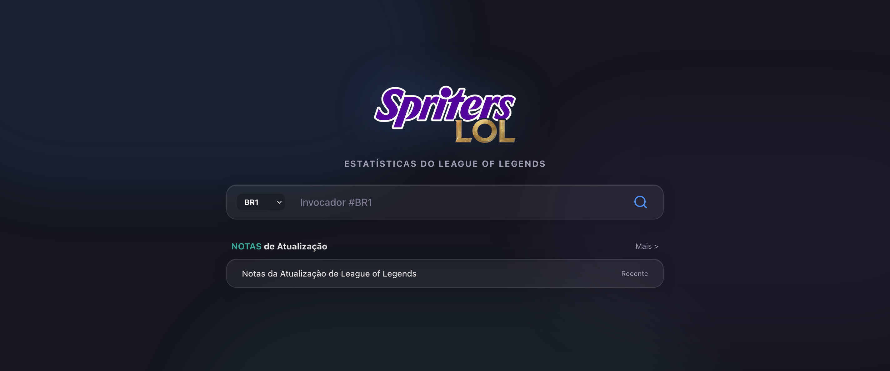

<p align="center">
  
</p>

<p align="center">
  
  
  
  
</p>

# Spriters LOL

O Spriters LOL e uma plataforma de alta fidelidade para analise de desempenho de jogadores de League of Legends. A ferramenta utiliza as APIs oficiais da Riot Games para extrair dados historicos detalhados, calcular pontuacoes de performance individuais e sugerir melhorias de jogo com base na rota principal do invocador.

---

## Recursos Principais

### Analise e Avaliacao de Desempenho
*   Taxa de Vitoria Dinamica: Calculo em tempo real da taxa de vitorias com base em filtros ativos (Ranqueada Solo, Ranqueada Flex e ARAM).
*   Radar de Atributos: Grafico comparativo que ilustra o desempenho em Farm, Visao, KDA e Dano do invocador contra a media do elo desejado.
*   Metas por Rota: Ajuste de estatisticas de elo recomendadas de acordo com a rota selecionada (Top, Jungle, Mid, ADC, Suporte).

### Historico Avancado de Partidas
*   Visualizacao Estilizada: Cards de partidas com indicacao de resultado e badges dedicados a conquistas (MVP, ACE, Double/Triple/Quadra/Penta Kill).
*   Tooltip Detalhado de Invocadores: Painel flutuante exibido ao passar o cursor sobre qualquer jogador da partida, revelando Elo Atual, KDA, Win Rate de partidas recentes e rota mais jogada de forma assincrona.

### Busca Inteligente de Invocadores
*   **Hashtag Dinâmica e Chip Premium**: Barra de pesquisa aprimorada que separa de forma fluida o Nome do Invocador e a Hashtag (`#tag`) em um chip visual que se desloca dinamicamente ao digitar.
*   **Comportamento Inteligente de Foco**: Foco automático transferido para a hashtag ao digitar `#` no campo do nome e retorno ao nome ao apagar a tag com `Backspace`. Toda a área livre da barra de busca foca o input de nome ao ser clicada.
*   **Suporte a Regiões da Riot**: Lista de regiões expandida com todas as 16 plataformas suportadas oficialmente pela API da Riot Games, com traduções perfeitas e suporte a navegação por teclado (setas do teclado, rolagem automática e confirmação com Enter).

### Conexoes Recentes
*   Painel Jogado Com: Lista interativa contendo os invocadores com quem voce jogou a favor ou contra nas ultimas 20 partidas, com tooltips de elo e performance individual.

---

## Filosofia de Design: Liquid Glass

O projeto implementa uma linguagem de design proprietaria chamada Liquid Glass. Trata-se de uma aplicacao de Glassmorphism (vidro fosco translucido) otimizada para displays escuros de alta densidade.

*   Identidade Geometrica: Uso de arredondamento de cantos (rounded-2xl para paineis estruturais, rounded-xl para botoes e tooltips, e rounded-lg para tags).
*   Hierarquia de Z-Index: Empilhamento dinamico inteligente que garante que os baloes informativos de tooltip flutuem por cima de qualquer elemento sobreposto.

---

## Tecnologias Empregadas

*   Frontend: React 19, TypeScript, Tailwind CSS, Recharts.
*   Backend: Node.js, Express.
*   Compilador e Bundler: Vite.
*   Integracao: API da Riot.

---

## Como Executar o Projeto

### Pre-requisitos
*   Node.js 18 ou superior.
*   Uma chave de API da Riot.

### Instalacao
1.  Clone o repositorio do projeto:
    ```bash
    git clone https://github.com/AllvesMatteus/Spriters-LOL.git
    cd Spriters-LOL
    ```
2.  Instale as dependencias locais:
    ```bash
    npm install
    ```

### Configuracao
Crie um arquivo chamado `.env` na raiz do projeto contendo sua chave da Riot:
```env
RIOT_API_KEY=RGAPI-sua-chave-aqui
```

### Execucao em Desenvolvimento
Inicie o servidor backend:
```bash
npm run dev
```
Acesse a aplicacao no navegador em http://localhost:3000.

---

## Estrutura do Repositorio

```
├── api/                   # Rotas da API e funcoes de controle de servidor
├── public/                # Favicons e manifestos estaticos
├── src/
│   ├── assets/            # Imagens locais, logotipos e icones de rotas
│   ├── components/        # Componentes reutilizaveis (MatchHistory, RankCard, etc.)
│   ├── services/          # Conexoes e chamadas auxiliares de dados
│   ├── utils/             # Motores de calculo, cookies e ferramentas auxiliares
│   ├── App.tsx            # Estado raiz e carregamento de visualizacao
│   └── main.tsx           # Ponto de entrada de renderizacao React
├── server.ts              # Servidor Express Proxy e middleware do Vite
├── DESIGN_SYSTEM.md       # Documentacao do sistema de design visual
└── README.md              # Documentacao principal do projeto
```

---

## Termos de Uso e Licenciamento

Este projeto e desenvolvido estritamente para fins de aprendizado e portfolio pessoal. Todos os dados referentes a jogadores, partidas e emblemas sao propriedade intelectual da Riot Games.

> O Spriters LOL nao e endossado pela Riot Games e nao reflete as visoes ou opinioes da Riot Games ou de qualquer pessoa oficialmente envolvida na producao ou gerenciamento do League of Legends.
